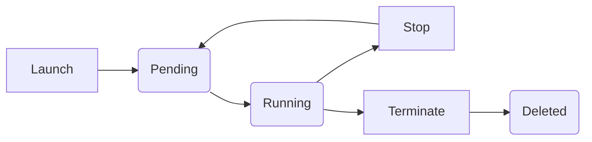

# AWS EC2 (Elastic Compute Cloud) -

## 1. Introduction to EC2

**Amazon EC2 (Elastic Compute Cloud)** is one of the most fundamental services in AWS. It provides resizable compute capacity in the cloud, effectively allowing you to rent virtual computers to run your own applications.

* **Elastic:** You can increase or decrease the number of servers within minutes.
* **Compute:** Refers to the processing power (CPU) and memory (RAM).
* **Cloud:** These resources reside in AWS data centers globally.

---

## 2. Core Concepts for Beginners

### A. What is an Instance?

An "Instance" is a virtual server in the AWS cloud. When you "launch an instance," you are starting a virtual machine with a specific Operating System (OS) and hardware configuration.

### B. Amazon Machine Image (AMI)

An **AMI** is a template that contains the software configuration (operating system, application server, and applications) required to launch your instance.

* **Examples:** Ubuntu, Amazon Linux, Windows Server, macOS.
* **Version Control:** AMIs like Ubuntu 22.04 (Jammy) or 20.04 (Focal) allow developers to stick to specific environments.

### C. Instance Types (The Hardware)

Instance types are grouped into **Families** optimized for different use cases.

| Family                      | Purpose                                                      | Example                     |
| :-------------------------- | :----------------------------------------------------------- | :-------------------------- |
| **General Purpose**   | Balanced CPU, Memory, and Networking. Good for web servers.  | `t2.micro`, `t3.medium` |
| **Compute Optimized** | High-performance processors. Good for batch processing.      | `c5.large`                |
| **Memory Optimized**  | Fast performance for workloads that process large data sets. | `r5.xlarge`               |
| **Storage Optimized** | Optimized for high, sequential read/write access.            | `i3.large`                |

---

## 3. Security & Connectivity (Intermediate)

### A. Key Pairs

Key pairs are the security credentials used to prove your identity when connecting to an EC2 instance.

* **Private Key:** Stored by you (usually a `.pem` file).
* **Public Key:** Stored by AWS on the instance.
* > ⚠️ **Warning:** If you lose your private key, you cannot access your instance. If someone else gets your key, they can hack your instance.
  >

### B. Security Groups (Virtual Firewall)

A Security Group acts as a virtual firewall for your instance to control inbound and outbound traffic.

* **SSH (Port 22):** Allows you to log into the terminal.
* **HTTP (Port 80):** Allows web traffic.
* **Source IP:** You can restrict access to "Anywhere" (`0.0.0.0/0`) or just "My IP" for maximum security.

### C. Elastic IP Addresses (Static IPs)

By default, EC2 instances have a **Dynamic IP** that changes whenever the instance is stopped and started.

* An **Elastic IP** is a static, public IPv4 address designed for dynamic cloud computing.
* **Cost Tip:** AWS provides Elastic IPs for free *as long as they are associated with a running instance*. If an IP is unattached or the instance is stopped, you will be charged to prevent IP hoarding.

---

## 4. Lifecycle and Cost Management (Advanced)

### Life Cycle Management

| State               | Billing Status         | Data Retention                              |
| :------------------ | :--------------------- | :------------------------------------------ |
| **Stop**      | Compute billing stops. | EBS data is kept. You can restart it later. |
| **Terminate** | All billing stops.     | The instance is permanently deleted.        |
| **Reboot**    | No impact on billing.  | Instance just restarts (like a PC).         |

### The "Free Tier" Details

AWS offers a generous free tier for the first 12 months of your account:

* **750 Hours/Month:** This allows one instance of `t2.micro` (or `t3.micro` depending on region) to run 24/7 for the whole month.
* **Storage:** Up to 30 GB of EBS (Elastic Block Store) SSD storage.

---

## 5. Real-World Applications

1. **Hosting Websites:** Using `t2.micro` or `t3.small` to run a Node.js or Python backend.
2. **Development Environments:** Quickly spinning up an Ubuntu instance to test code in a clean environment.
3. **Data Processing:** Using Compute Optimized instances to handle heavy video encoding or scientific simulations.
4. **Database Hosting:** Running relational databases (though AWS RDS is often preferred).

---

## 6. Quick Revision Section

> **What is an AMI?**
> An OS template (e.g., Ubuntu 22.04).

> **Why use an Elastic IP?**
> To keep the public IP address the same even if the instance restarts.

> **Difference between Stop and Terminate?**
> Stop is like turning off a computer (can be turned back on); Terminate is like throwing the computer in the trash (permanent deletion).

> **What is the most common General Purpose instance for testing?**
> `t2.micro` (Free Tier eligible).

> **How do I connect to a Linux EC2 instance?**
> Via **SSH** using a **Key Pair**.

---
