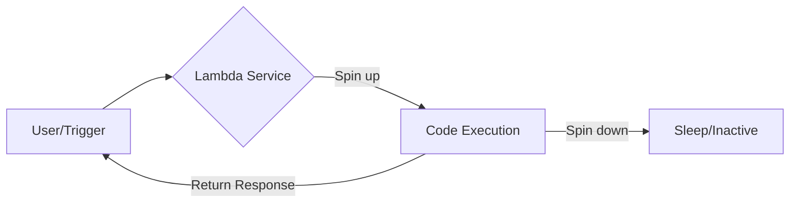

# AWS Compute Services: EC2 vs. Serverless (Lambda)

## 1. Introduction to Amazon EC2 (Elastic Compute Cloud)

Amazon EC2 is a foundational AWS service that provides **resizable compute capacity** in the cloud. Think of it as renting a virtual computer (instance) where you have total control over the operating system and software.

### **The Non-Serverless Workflow (Stateful)**

When using EC2, you are responsible for the entire lifecycle of the server:

* **Operating System:** You choose the OS (Ubuntu, Windows, Amazon Linux).
* **Configuration:** You install the runtime (Node.js, Python, Java) and libraries.
* **Scaling:** You manage how the server grows (Auto Scaling Groups) to handle traffic.
* **Maintenance:** You patch the OS and manage security.

---

## 2. Launching an EC2 Instance: Core Components

### **A. Amazon Machine Image (AMI)**

An AMI is a template that contains the software configuration (OS, application server, and applications).

* *Example:* Ubuntu 22.04 LTS (Jammy Jellyfish).

### **B. Instance Types (Hardware Spec)**

AWS categorizes instances into families based on performance:

| Family                              | Use Case                                 | Features                            |
| :---------------------------------- | :--------------------------------------- | :---------------------------------- |
| **General Purpose (T2/T3)**   | Web servers, small DBs                   | Balanced CPU/Memory                 |
| **Compute Optimized (C5/C6)** | Batch processing, high-traffic web       | High-performance processors         |
| **Memory Optimized (R5/R6)**  | Real-time big data, high-performance DBs | Fast performance for large datasets |
| **Arm-Based (Graviton)**      | Cost-efficient high performance          | Custom AWS silicon                  |

### **C. Key Pairs & Security**

* **Key Pair:** A security credential consisting of a private key (stored by you) and a public key (stored by AWS). You need this to connect via SSH.
* **Security Groups:** A virtual firewall that controls inbound and outbound traffic.

### **D. Networking: Dynamic vs. Elastic IP**

* **Auto-assigned IP:** This is dynamic; it changes every time the instance stops and restarts.
* **Elastic IP:** A static, fixed IPv4 address.
  * *Pro Tip:* AWS charges for Elastic IPs that are **not** associated with a running instance to prevent IP hoarding.

---

## 3. Introduction to Serverless (AWS Lambda)

Serverless does **not** mean there are no servers. It means **you** don't manage them. AWS handles the infrastructure, scaling, and high availability.

### **How Lambda Works**

### **Key Characteristics**

1. **Pay-per-Invocation:** You only pay when your code runs. No traffic = Zero cost.
2. **Stateless:** Each execution is independent. It doesn't remember what happened in the previous call.
3. **Automatic Scaling:** If 1,000 users hit the API, AWS runs 1,000 copies of your function in parallel.

---

## 4. EC2 vs. Serverless: The Comparison

| Feature              | EC2 (Instance-Based)                   | Lambda (Serverless)            |
| :------------------- | :------------------------------------- | :----------------------------- |
| **Management** | High (You manage OS/Scaling)           | Zero (AWS manages everything)  |
| **Pricing**    | Hourly (Fixed regardless of usage)     | Per Invocation + Duration      |
| **State**      | Stateful (Good for socket connections) | Stateless (Ephemeral)          |
| **Start Time** | Instant (Always running)               | Cold Start (Delay if inactive) |
| **Control**    | Full root access                       | Restricted to code only        |

---

## 5. Advanced Concepts: Trade-offs

### **The "Cold Start" Problem**

In serverless, if a function hasn't been used for a while, AWS "kills" the environment to save resources. When a new request comes in, AWS must spin up a new container, causing a small delay known as a **Cold Start**.

### **Stateless Connection Challenges**

Because Lambda functions start and stop constantly, managing database connections (like MongoDB or SQL) is tricky. Each function might try to open a new connection, potentially exhausting the database's connection limit.

### **Real-World Case Study: Prime Video**

Amazon Prime Video famously switched a monitoring service from serverless to EC2/ECS.

* **Why?** The service required constant state monitoring and high-frequency data polling.
* **Result:** Moving to a monolith/EC2 architecture saved 90% in costs for that *specific* high-frequency workload.
* **Lesson:** Serverless is great for APIs and event-driven tasks, but dedicated servers are often cheaper for constant, heavy processing.

---

## 6. Quick Revision Section

> **What is an Instance?**
> A virtual machine running in the AWS cloud.

> **What is an AMI?**
> A template for the instance's OS and pre-installed software.

> **When should I use Lambda over EC2?**
> Use Lambda for unpredictable traffic, event-driven tasks (like Alexa or Cron jobs), and when you want to minimize management overhead.

> **Does Lambda cost money if no one uses it?**
> No. Under the free tier, you get 1 million requests per month for free.

> **Why did Prime Video shift some parts to EC2?**
> To save costs on high-frequency, state-heavy workloads that were expensive to run as serverless functions.

---
