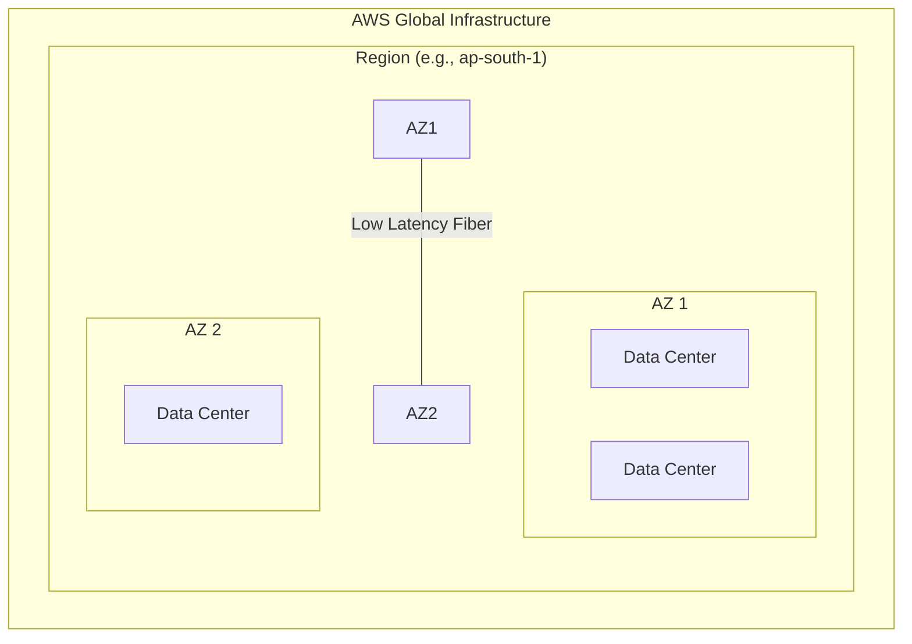

# AWS Fundamentals: Global Infrastructure & Identity Access Management (IAM)

## 1. AWS Global Infrastructure Architecture

AWS is designed to be the most flexible and resilient cloud provider. Its infrastructure is organized into a specific hierarchy to ensure high availability and fault tolerance.

### **The Hierarchy of Infrastructure**

1. **Regions**: A physical geographical location (e.g., Mumbai, North Virginia). Each Region is completely independent.
2. **Availability Zones (AZs)**: Clusters of one or more discrete data centers within a Region.
3. **Data Centers (DC)**: Physical facilities containing the actual servers, storage, and networking hardware.

### **Key Technical Characteristics**

* **Isolation**: Regions are isolated from each other to prevent "blast radius" effects. If one region fails, others remain unaffected.
* **Connectivity**: AZs within a region are connected via **low-latency, high-throughput links** using private fiber.
* **Mumbai Region Example**: Includes multiple AZs (e.g., `ap-south-1a`, `ap-south-1b`).

### **Infrastructure Diagram**



---

## 2. AWS Identity and Access Management (IAM)

IAM is the security core of AWS. It controls **who** can access **what** resources.

### **A. Root User vs. IAM User**

| Feature                 | Root User                                     | IAM User                                        |
| :---------------------- | :-------------------------------------------- | :---------------------------------------------- |
| **Identity**      | The email address used to create the account. | A specific identity created within the account. |
| **Permissions**   | Unrestricted access (Admin).                  | Granular permissions defined by policies.       |
| **Best Practice** | **Never** use for daily tasks.          | Create unique users for every person/app.       |

### **B. IAM Components**

* **Users**: Individuals or applications.
* **Groups**: A collection of users. Scaling permissions is easier by applying policies to a group (e.g., a "Developers" group) rather than individual users.
* **Policies**: JSON documents that define permissions.
* **Roles**: Temporary identities with specific permissions (e.g., allowing an EC2 instance to access an S3 bucket).

### **C. Customizing the Sign-in Experience**

By default, IAM users sign in via a URL containing the 12-digit AWS Account ID. For better usability, you should create an **Account Alias**.

* **Default**: `https://123456789012.signin.aws.amazon.com/console`
* **Alias**: `https://your-company-name.signin.aws.amazon.com/console`

---

## 3. Practical Permission Management (JSON Policies)

AWS uses JSON-based policies to govern access.

### **Scaling Access with Groups**

Instead of manually attaching permissions to 100 developers, attach them to a "Developer Group." When a developer joins the team, simply add them to the group.

### **JSON Policy Structure**

A policy allows or denies specific **Actions** on specific **Resources**.

**Example: Read-Only S3 Access for a Specific Bucket**

```json
{
    "Version": "2012-10-17",
    "Statement": [
        {
            "Effect": "Allow",
            "Action": [
                "s3:ListBucket",
                "s3:GetObject"
            ],
            "Resource": [
                "arn:aws:s3:::my-secure-bucket",
                "arn:aws:s3:::my-secure-bucket/*"
            ]
        }
    ]
}
```

### **Important Constraints**

* **Policy Limit**: You can only attach up to **10 managed policies** to a single IAM entity (User/Group/Role).
* **Solution**: Use Groups or combine permissions into custom inline policies to stay within limits.

---

## 4. Real-World Application & Security Best Practices

1. **Least Privilege**: Give users only the permissions they need to perform their job (e.g., an intern should only have `List` permissions, not `Delete`).
2. **Enable MFA**: Multi-Factor Authentication is mandatory for the Root user and highly recommended for all IAM users.
3. **Regional Latency**: Deploy your applications in the Region closest to your users to minimize latency.

---

## 5. Quick Revision Section

> **What is an AZ?**
> A discrete cluster of data centers within a Region, isolated from other AZs but connected via high-speed links.

> **Why use Groups in IAM?**
> For scalability and ease of management. Changing a group policy updates permissions for all users inside that group instantly.

> **What is an ARN?**
> **Amazon Resource Name**. It uniquely identifies any AWS resource across the entire global infrastructure.

> **How many managed policies can you attach to a user?**
> 10.

---
