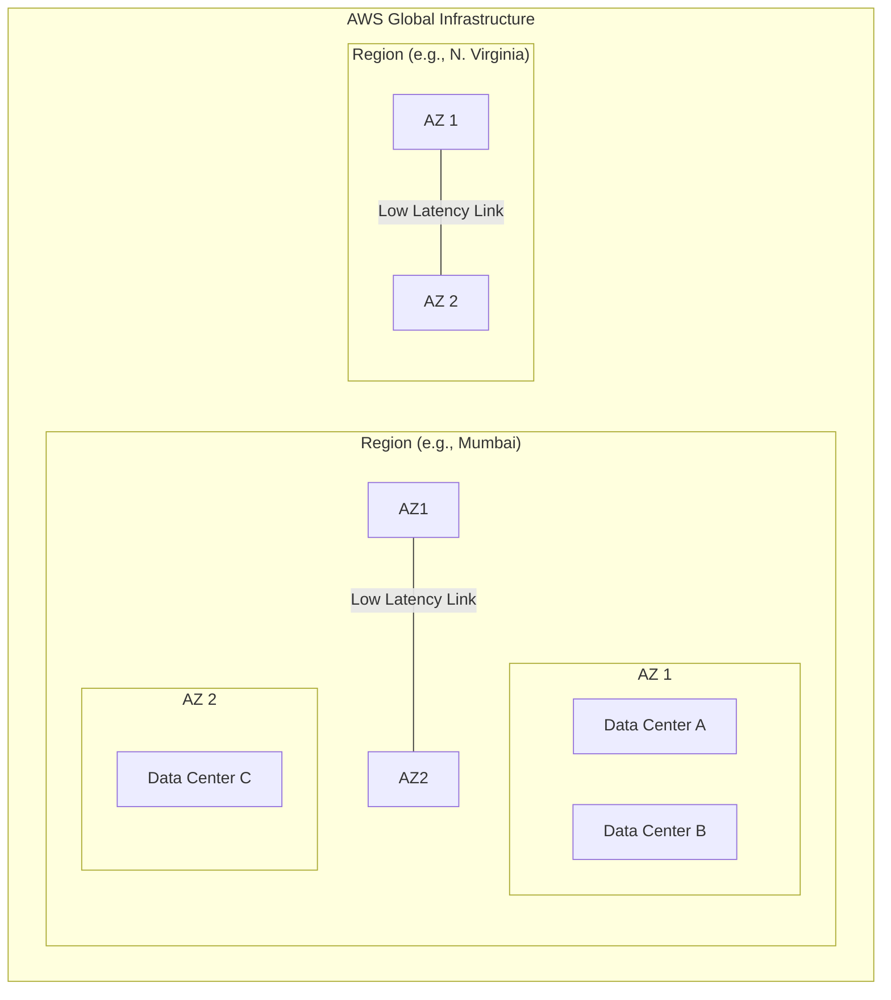

# AWS Global Infrastructure: Core Concepts & Architecture

## Introduction

Amazon Web Services (AWS) operates a massive, highly available, and secure cloud infrastructure spread across the globe. Understanding how this infrastructure is organized is fundamental to designing cloud-native applications that are resilient to failures.

---

## 1. The Core Hierarchy

The AWS Global Infrastructure is organized into a nested hierarchy designed for maximum performance and fault tolerance.

### **A. Regions**

A **Region** is a physical geographical location in the world where AWS clusters its data centers.

* **Isolation:** Each region is completely independent and isolated from other regions.
* **Compliance:** Regions allow users to store data in specific geographic locations to meet legal and regulatory requirements (Data Sovereignty).
* **Example:** `ap-south-1` (Mumbai), `us-east-1` (N. Virginia).

### **B. Availability Zones (AZs)**

Each Region consists of multiple, isolated locations known as **Availability Zones**.

* **Physical Separation:** AZs are physically separated by a meaningful distance (miles) within a region to protect against local disasters like fires or floods.
* **Connectivity:** All AZs in a Region are interconnected with **high-bandwidth, ultra-low-latency networking** over dedicated metro fiber.
* **Redundancy:** If one AZ goes down, the others remain operational, ensuring high availability.

### **C. Data Centers (DC)**

Availability Zones are comprised of one or more discrete **Data Centers**.

* These house the actual physical servers, storage, and networking hardware.
* They feature redundant power, cooling, and physical security.

## **D. Edge Locations**

👉 Edge Location = **CDN (Content Delivery Network) servers**

AWS ka service: **CloudFront**

---

### 🔥 Simple samajh:

Edge Location = **user ke paas mini server**

---

### 🧠 Kaam kya karta hai?

* Static content (images, videos, CSS) ko cache karta hai
* User ko **nearest location se data deta hai**

---

### ⚡ Real-world Example:

Agar tumhari website US mein host hai

aur user Pakistan mein hai

Without Edge Location:

👉 Data US se aayega → slow

With Edge Location:

👉 Data nearby Edge server se aayega → fast 🚀

---

## 2. Infrastructure Diagram

---

## 3. Key Technical Characteristics

| Feature                   | Description                                                                                        |
| :------------------------ | :------------------------------------------------------------------------------------------------- |
| **Low Latency**     | AZs are connected via private fiber, ensuring data transfers happen in milliseconds.               |
| **Fault Tolerance** | Applications deployed across multiple AZs can survive the failure of an entire data center.        |
| **Scalability**     | You can scale resources globally by deploying in multiple regions to stay close to your end-users. |
| **High Security**   | AWS monitors the global infrastructure 24/7 with strict physical and digital surveillance.         |

---

## 4. Real-World Application: The Mumbai Case Study

As discussed in the video, AWS provides a localized example for the Indian market:

* **Region:** Mumbai.
* **Infrastructure:** Includes **2 Availability Zones** (at the time of the recording).
* **Use Case:** An Indian e-commerce company would host its database in AZ-1 and a synchronous backup in AZ-2. If a power grid failure hits AZ-1, the website stays online using AZ-2.

---

## 5. Global Footprint (As per Video)

* **21 Regions** globally.
* **64 Availability Zones** globally.
* *Note: These numbers increase as AWS continues to expand its global footprint.*

---

## 6. Quick Revision Section

> **What is a Region?**
> A physical geographical area containing multiple Availability Zones.

> **What is an Availability Zone (AZ)?**
> One or more discrete data centers with redundant power, networking, and connectivity.

> **How are AZs connected?**
> Via high-speed, low-latency private fiber links.

> **Why use multiple AZs?**
> To achieve **High Availability** and **Fault Tolerance**. If one AZ fails, your application stays up.

> **Why use multiple Regions?**
> To reduce latency for global users and to comply with local data laws.

---

### 💡 Pro Tip for Developers:

When deploying services like **Amazon EC2** or **RDS**, always select at least two Availability Zones to ensure your application doesn't have a single point of failure (SPOF).
